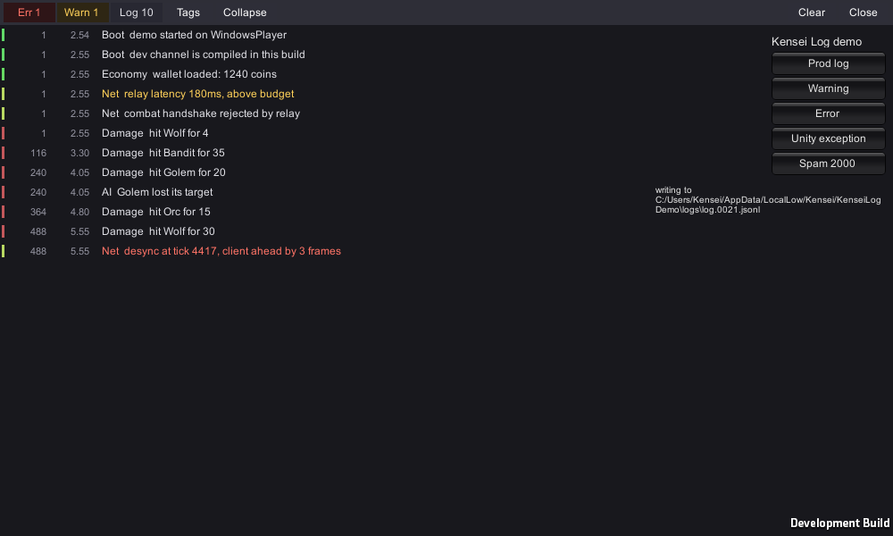
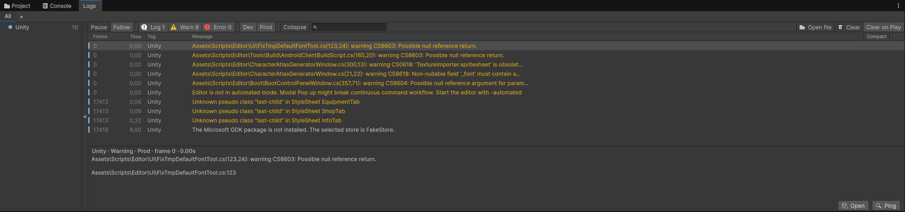
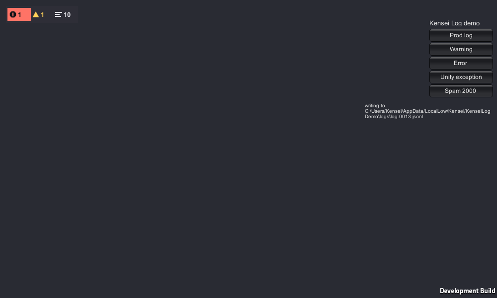
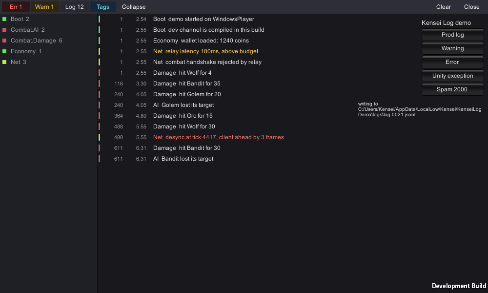
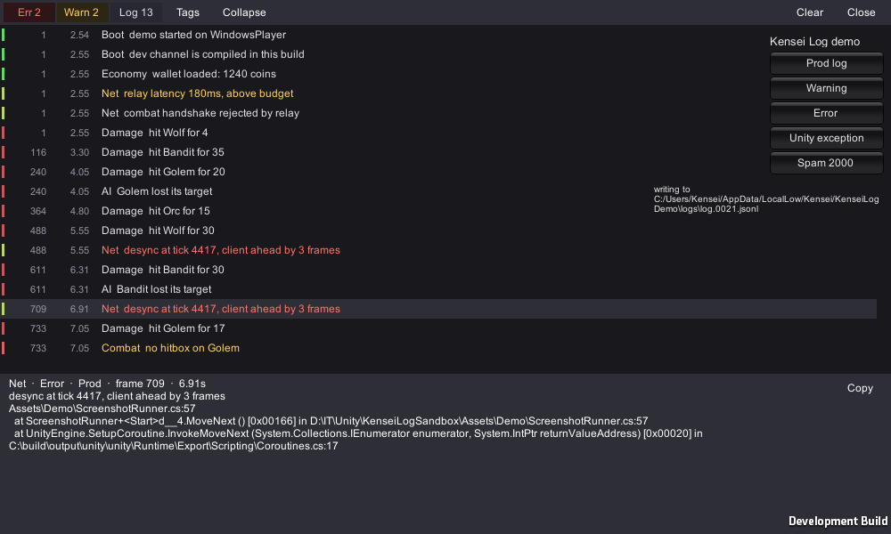
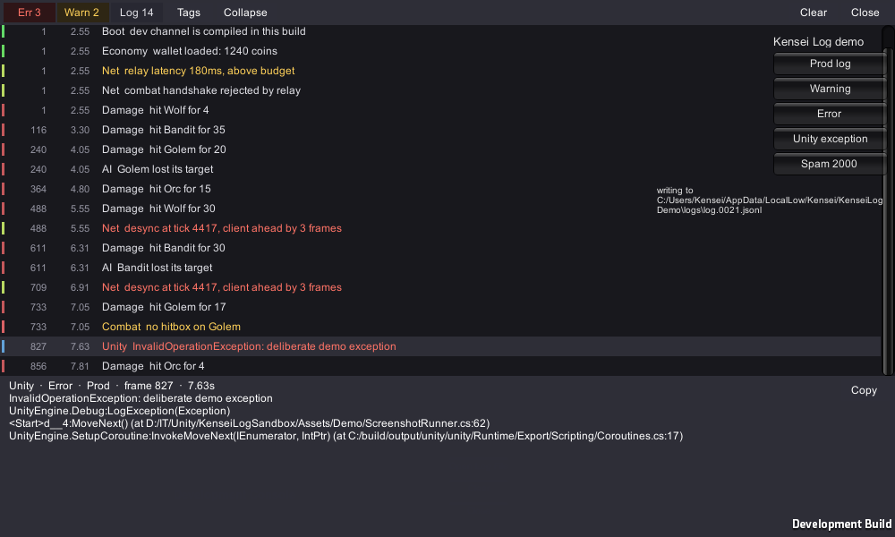

# Kensei Log

Tagged logging for Unity with two channels, an editor window that splits logs into saved filter tabs, and a viewer that runs on the device.



In Unity's console a tag is only a word in the message, so filtering for `combat` finds every line that happens to mention combat, and there is no way to keep a view around once you have built it. Kensei Log makes the tag a real field on the record, lets you save the views you keep rebuilding, and follows the same logs into a build — into a file, and onto the screen of the device running it.

## Install

Package Manager → **Add package from git URL**:

```
https://github.com/KenseiTheOne/KenseiLog.git#v0.16.0
```

The tag pins the version — put the one you want after the `#`; the newest is at the top of
[CHANGELOG.md](CHANGELOG.md). Leave the tag off and you track `main`, which is fine until a
release renames something: 0.14.0 renamed every method on the facade.

Or point at a checkout on disk from `Packages/manifest.json`, with the path relative to the
project's `Packages` folder:

```json
"com.kensei.log": "file:../../KenseiLog"
```

The runtime assembly is auto-referenced, so `Log` is available from `Assembly-CSharp` without adding an assembly definition of your own.

## Usage

```csharp
using KenseiLog;

public static class Tags {
    public const string Combat = "Combat";
    public const string Damage = "Combat.Damage";
    public const string Net    = "Net";
}

Log.DevInfo(Tags.Damage, "hit " + target.name + " for " + damage, this);
Log.DevWarning(Tags.Combat, "no hitbox on " + target.name);
Log.Error(Tags.Net, "desync at tick " + tick);
```

Six methods, three levels across two channels. The prod channel takes the plain names —
`Info`, `Warning`, `Error` — because a log that survives into a shipped build is the one you
should reach for without thinking. The dev channel spells itself out: `DevInfo`, `DevWarning`,
`DevError`.

### One tag per file

When a file always logs under the same tag, state it once:

```csharp
using Logger = KenseiLog.Logger;   // UnityEngine has a Logger of its own

private static readonly Logger Log = Logger.For(Tags.Combat);

Log.DevInfo("hit " + target.name + " for " + damage);
Log.Error("desync at tick " + tick);
```

The alias is needed in any file that also has `using UnityEngine;`, which is most of them:
`UnityEngine.Logger` exists and the two names collide. Writing `KenseiLog.Logger` in full does
the same job.

Naming the field `Log` shadows the static `Log` class inside that type, which is the point —
every unqualified call in the file then carries the tag. Reach a different tag from the same
file with the full `KenseiLog.Log.DevInfo(tag, message)`.

`Logger` is a struct, so the field costs a string reference and no allocation. Its dev
methods carry `[Conditional]` exactly as the static ones do — the attribute applies to
instance methods too — so they leave a release build with their arguments. The field
initialiser does not: it survives as one assignment per type, which is the whole price.

`Logger.For(Tags.Combat).Child("AI")` gives `Combat.AI`, nested under `Combat` in the tree.

### No tag at all

A tag is not required. `Log.DevInfo("still here")` writes under `Untagged`, which keeps the log
you are about to delete inside the window and apart from the engine's chatter — reaching for
`Debug.Log` instead buries it under the `Unity` tag. A branch of the tag tree filling up with
these is a fair hint about where a real tag belongs.

Tags are plain strings — nothing has to be registered, and any string works. A `const` holder like the one above only buys you autocomplete and safe renames. A dot in a tag builds a hierarchy: selecting `Combat` in the window also selects `Combat.Damage` and `Combat.AI`.

## The two channels

**Dev calls disappear in release.** They carry `[Conditional("UNITY_EDITOR"), Conditional("DEVELOPMENT_BUILD")]`, so outside the editor and development builds the compiler removes the call *and every argument expression*. Building the message costs nothing because it never runs.

**Prod calls always compile.** In a shipped build they are the only diagnostics you get, which is why they hold the unprefixed names.

That split only works if it is kept honestly. Decide once what counts as a prod event and write it down — otherwise everything drifts into the dev channel out of habit and the shipped build tells you nothing. A reasonable starting rule:

| Prod | Dev |
| --- | --- |
| state machine transitions | per-frame values |
| network errors, retries, disconnects | tuning and balance numbers |
| purchases, saves, loads | "got here" traces |
| scene and asset load failures | verbose subsystem chatter |
| application lifecycle | anything you would delete after fixing the bug |

## Cost

`Debug.Log` unwinds and formats a stack trace on every single call — `StackTraceLogType.ScriptOnly` is the default for all three levels — marshals the string into native code, and is never stripped from release builds.

The pipeline here allocates nothing of its own: records are structs, the call site is captured by the compiler through `[CallerFilePath]`/`[CallerLineNumber]` at no runtime cost, and a stack trace is only unwound for `Error`. What a call costs is the message string you built, plus whatever the registered sinks do with it. The file sink is on by default and is the one that does real work: a JSON line and a buffered write per prod record.

One trap worth knowing, and it applies to `Debug.Log` too. Unity compiles as C# 9, where `$"hit {damage}"` with an `int` lowers to `string.Format` — boxing, a params array, and format parsing. `"hit " + damage` lowers to `string.Concat` with a direct `ToString`, which is cheaper for the same text.

## The window

**Window → Kensei → Logs**



- **Tabs are saved filters.** A tab remembers its tags, levels, channels, search text, collapse setting and any isolated frame. One tab is active at a time, so `Combat` and `Net` are a click apart rather than visible at once — but neither has to be rebuilt.
- **The tag tree** on the left is built from the tags actually seen this session, with counts, and fills in the parents: log `Combat.Damage` and `Combat` appears above it. A typo'd tag shows up there as its own branch instead of silently vanishing. Branches fold, and stay folded across restarts; the arrow on its right edge hides and shows the whole tree.
- **Colour means two things, kept apart.** The tag colours the stripe at the left of the row — a stable hue derived from the tag's root segment, so a family shares a hue and descendants differ only in brightness. The level colours the text, following the editor theme's own warning and error colours.
- **Search looks at the message only.** Tags are a field, so searching for `combat` never pulls in the `Combat` tag by itself.
- **Double-click** opens what the log points at. Records written through this API carry their
  call site from the compiler; captured ones carry none, so the first project frame in their
  stack trace is used instead. When a log has no source at all because the engine raised it
  against an asset — a USS warning naming a StyleSheet — the asset opens, which is what
  Unity's own console does.
- **Ping** highlights the related object. Logs the engine raised against an asset rather than
  a script — a USS warning naming a StyleSheet — reach it too: the capture callback passes no
  context object, so the window asks Unity's own console store for it. That store is internal,
  so the lookup is probed once and disables itself if a Unity version moves it; nothing about
  logging depends on it, only this extra navigation. When the object is gone the button is
  disabled and its tooltip says so, rather than letting you press it for nothing.
  The object survives a recompile with the rest of the session file, so the button keeps
  working on this package's own records across a reload. It is honoured only for the editor's
  own session file: an instance id means something inside the editor session that issued it
  and nowhere else, so for a file opened with **Open file** it is ignored — from another
  machine's build it would resolve here to whatever happens to hold that number, and Ping
  would jump to an unrelated object.
- **Right-click a row** to isolate its frame, filter by its tag, or copy the message. Isolating a frame is what you want for a bug that only happens on one.
- **Collapse** folds repeats into one row with a counter, which keeps a stray log in `Update` from drowning the view.
- **Right-click the column header** — or press the button at its right end — to choose which of frame, time and tag to show. It lives on the header because that is where anyone looks to change the column under it. A window setting rather than a per-tab one: which columns you want is a habit, and having the layout change as you switch tabs would only surprise you.
- **Compact**, in the corner of the column header beside the column menu, hides the tag tree and every column but the message, for when you only want to read. It is a mode over your preferences, not a rewrite of them: it stores nothing, leaving it gives back exactly what you had, and while it is on the controls it overrides are disabled rather than silently ignored.

Logs that never touched this API — engine exceptions, errors from other packages, anything calling `Debug.Log` directly — are folded in under the `Unity` tag, so the view is not missing the unhandled exception you actually needed.

The window fills itself in when it loads, so it shows what happened before you opened it. After a recompile that comes from its own session file, where the tag, the channel, the frame and the call site all survive — none of which Unity's console has anywhere to keep, and a `Log.DevInfo` call was never in the console to recover at all. Whatever the console holds that the file cannot account for is added to it, matched off by message so nothing appears twice. A fresh editor, or one with the session file turned off, reads the console alone.

**Compiler errors and warnings arrive as the compiler raises them**, through `CompilationPipeline`, not by reading the console. A compile that fails does not reload the domain, and by the time a later one succeeds Unity has removed those errors — so anything that waited for a reload would never show you a compile error at all. Like the console's own copies, they last until the compile that fixes them.

The session's boundaries are in the log too, under the `Editor` tag: `Editor started`, `Scripts reloaded`, `Entered play mode`, `Exited play mode`, each with the wall-clock time. The Time column counts from when logging started, which is a per-domain clock, so it resets at every recompile; the markers say where, and their wall clock is what turns any row's elapsed time back into a time of day.

The window keeps everything until you press **Clear**, as Unity's console does — there is no limit to set, and nothing leaves it on its own.

## Logs from a build

A shipped build has no console, so the prod channel goes to disk:

```
<persistentDataPath>/logs/log.0007.jsonl   the running session
<persistentDataPath>/logs/log.0006.jsonl   the one before it
<persistentDataPath>/logs/log.0005.jsonl   ...
```

Numbers rise with time and are never reused, so the highest is the one in hand. Every run starts a new file, so a report is never a blend of two sessions, and files past `RetainedFileCount` behind the current one are deleted rather than renumbered — the file a tester mentions stays the file they meant. Each file opens with a header line naming the product and version, Unity version, platform, device model, start time and a session id — the answer to "reproduced on what?", which is always the first question.

Lines are buffered, but an **error flushes immediately**, as does the app being paused. On mobile that pause is the last signal you get before the process is killed, and it is usually the one that matters.

In the editor that sink only runs during play mode: it starts a run by opening a new file, and a script recompile is not a run.

What the editor itself logs goes to `logs/editor`, one file per editor session rather than per domain reload, so records written from an editor tool survive a recompile — and an accidental **Clear**, which has never touched a file. One file per editor *process*, to be exact: an asset import worker and an out-of-process profiler both reload the domain just as the editor does and share the project this directory is keyed by, so both stay out of here entirely. A reload keeps to the file it was writing whether or not it read anything back — including the reload that enters play mode with **Clear on Play** set, which skips the read on purpose. It takes the dev channel, which is the point of it. During play mode in the editor both sinks are registered, so those records are written twice: once to the run's file, once to the editor's. `EditorSink.WriteSessionFile` turns the editor's file off, from the next domain reload on.

After a recompile the window reads the whole session back: every file this editor session has filled, from the one it started with — and never further back, so an editor that has since closed does not leave its records in your window. Those files stay on disk for as long as the session runs, however many it fills; `RetainedFileCount` prunes only what earlier sessions left. After a **Clear** the read starts at the file that was being written when you cleared, so with **Clear on Play** a recompile reads back little more than the last run. The read is what a recompile pays for keeping everything: about half a second for every hundred thousand records logged since the last clear, measured headless with records of an ordinary length. Holding them costs about twenty megabytes per hundred thousand. It skips the read altogether when the reload is the one that enters play mode with Clear on Play set, since that seed would be thrown away a moment later. **Clear** stays cleared across a reload — the file keeps everything, but what you dismissed does not come back.

Dev records stay out of the file by default. In a release build they do not exist at all, and in the editor they would bury the prod events worth keeping — set `FileIncludesDevChannel` if you want them.

To read a file back, open **Window → Kensei → Logs** and press **Open file** in the toolbar. It loads into the same window with the same tabs, tags and filters as a live run, including files that are still being written.

## Logs on the device, while playing

A file answers "send it to me afterwards". The overlay answers "what just happened, right now, on this phone".

```csharp
LogConfig config = LogConfig.Default();
config.ShowOverlay = true;
LogCore.Configure(config);
```




A small bubble appears in the corner, holding all three counts at once: errors, warnings, logs, always in that order and always all three. Each carries a mark rather than a word — a round badge with an exclamation in it, a triangle, three lines — so the level is told by silhouette before colour, which is what survives a screenshot pasted into a bug report in greyscale. A level with nothing to report keeps its place, goes grey and drops its number, so the badge never changes shape as it counts. The worst level present, if it is a warning or an error, is inverted onto a plate of its own colour: that is the part the corner of the eye catches without reading anything. Logs never light it up — a badge that brightens because the game logged at all is the panel nobody asked for. Past 999 a count is shortened rather than capped — `1.2k`, `47k`, `3M` — and it counts every record of that level, including the ones a burst pushed out of the overlay's buffer before anything could read them. Drag it anywhere, tap it to open the viewer: level toggles with the same counts in the same order, a tag list, **Collapse** to fold repeats into one row with a count beside it, tap a row for its detail, and Copy to put the whole thing on the clipboard.

A level's count is how many records of it were written, not how many the viewer still holds — a burst longer than the buffer is counted in full and listed in part, so a toggle reading `1.2k` above five hundred rows is the two of them answering different questions.

The tag list offers the tags this session actually logged, so unlike the editor window it will not show a `Combat` entry unless something logged under exactly that tag. Selecting one follows the same rule as the window, so `Combat` brings in `Combat.Damage` too.



The detail pane takes about a third of the overlay's height, to a ceiling of 180 points, and does not scroll, so a long stack trace is clipped — **Copy** is how you get the whole thing off the device.



It is off by default. A debug panel that shows up in someone's game uninvited is worse than one you have to ask for.

**No setup.** No prefab, no Canvas, no `PanelSettings`, no package dependency — turning the flag on is the whole installation. That is also why it is drawn with IMGUI rather than uGUI or UI Toolkit: it cannot collide with your `EventSystem`, it works in every render pipeline, and it reads touches through `Event.current`, so a project on the new Input System is unaffected.

To keep it out of a public build entirely, guard the flag:

```csharp
#if DEVELOPMENT_BUILD || UNITY_EDITOR
config.ShowOverlay = true;
#endif
```

## Configuration

```csharp
[RuntimeInitializeOnLoadMethod(RuntimeInitializeLoadType.BeforeSplashScreen)]
private static void SetUpLogging() {
    LogConfig config = LogConfig.Default();
    config.MirrorToUnityConsole = true;
    LogCore.Configure(config);
}
```

| Option | Default | Effect |
| --- | --- | --- |
| `CaptureStackTraceOnError` | `true` | Unwind a stack trace for `Error` records |
| `MirrorToUnityConsole` | `false` | Also write records through `Debug.Log`, except ones captured from it |
| `CaptureForeignLogs` | `true` | Fold logs from outside this API into the pipeline |
| `WriteToFile` | `true`, `false` on WebGL | Write a rolling JSONL file under `persistentDataPath/logs` |
| `FileDirectory` | `null` | Where the files go; empty means `persistentDataPath/logs` |
| `FileSizeLimitKb` | `5120` | Rotate the current file once it passes this size (at least 64) |
| `RetainedFileCount` | `3` | How many older files to keep besides the one being written (at least 1) |
| `FileFlushIntervalSeconds` | `5` | How long buffered lines may wait; errors flush at once (at least 0.5) |
| `FileIncludesDevChannel` | `false` | Also write dev records to the file |
| `ShowOverlay` | `false` | Draw the in-game log viewer |
| `OverlayRecordCapacity` | `4096` | How many records the overlay keeps (at least 32) |
| `OverlayScale` | `0` | Overlay UI scale, or 0 to derive one from screen DPI, falling back to screen height |

`Configure` can be called at any time from the main thread; logging starts with the defaults during early initialisation so that nothing is lost before your call arrives.

On WebGL `WriteToFile` defaults to off. `persistentDataPath` there is a virtual filesystem inside the page, so the rolling history would hold megabytes of browser heap for a build with no way to fetch any of it back. Turn it on if you have one.

Outside the editor, the call site recorded on a record is trimmed to the part from `Assets` or `Packages` onwards. `CallerFilePath` is resolved by the compiler, so a release build otherwise carried - and wrote into the file a tester sends back - the absolute path of the machine that built it.

## Driving it from your own code

```csharp
MySink sink = new MySink();
LogCore.AddSink(sink);
LogCore.RemoveSink(sink);

LogCore.FlushSinks();                            // push every buffering sink to its destination
FileSink file = LogCore.File;                    // the active file sink, or null when file logging is off

LogOverlay.IsOpen = true;                        // open the on-device viewer from your own debug menu
LogOverlay.TagPaneVisible = true;
LogOverlay.SelectNewest(LogLevel.Error);         // jump to the newest error and expand it
```

From an editor script, where `window` is a `LogWindow`:

```csharp
LogWindow window = EditorWindow.GetWindow<LogWindow>();
window.AddTab(new LogFilter { Name = "Net", Tags = { "Net" }, ShowDev = false });
window.SelectNewest(LogLevel.Error);
```

A sink is anything that takes a record:

```csharp
public sealed class MySink : ILogSink {
    public void Write(in LogRecord record) {
        // Called on whichever thread logged, so this has to be safe from any of them.
    }
}
```

Implement `IFlushableSink` as well if it buffers, and `LogCore.FlushSinks` will reach it when the app pauses or quits.

Implement `IChannelFilteredSink` to say which channels are worth building at all:

```csharp
public sealed class MyProdOnlySink : ILogSink, IChannelFilteredSink {
    public void Write(in LogRecord record) {
        if (record.Channel != LogChannel.Prod) {
            return;
        }
        // ...
    }

    public bool Accepts(LogChannel channel) =>
        channel == LogChannel.Prod;
}
```

**`Accepts` is an optimisation, not a filter, and the `Write` check above is not redundant.** When *every* registered sink turns the dev channel down, a `Log.DevInfo` call stops before it builds a record at all — that is what keeps a dev call in a development build down to the message string you built, where the file sink is the only sink and the dev channel is off. The moment anything else takes the channel — the editor window does, and in the editor it is always registered — the record is built and handed to every sink, yours included. Prod records are built either way, stack traces on errors with them. So a sink that wants one channel has to say so in `Write` as well.

A sink that does not implement the interface is asked for everything, which is the safe answer for one this package knows nothing about. `Accepts` is called while the sink list is held, so answer it without taking a lock of your own.

The answers are cached and asked for again only when the sink list changes, so a sink that changes its mind while registered has to say so — `LogCore.RefreshChannelInterest()`. Until it does it goes on being treated as it answered when it arrived, and nothing will point at why it stopped seeing a channel.

`MemorySink` is one you can use as it is: a fixed-capacity ring of recent records with a version that changes whenever one arrives, so a view of your own can poll it instead of subscribing. It is what the in-game overlay reads.

```csharp
MemorySink recent = new MemorySink(256);
LogCore.AddSink(recent);

long watermark = 0;
LogRecord[] scratch = new LogRecord[recent.Buffer.Capacity];
int copied = recent.Buffer.CopyNewerThan(watermark, scratch);   // oldest first, returns how many
```

`LogRingBuffer` addresses records by `Sequence` rather than by position, because positions shift as the ring overwrites itself. It is safe to use from any thread.

### What a record holds

| Field | Type | Meaning |
| --- | --- | --- |
| `Sequence` | `long` | Rising id, unique for the lifetime of the app domain. Not contiguous: a sink that skips a channel leaves gaps |
| `Tag` | `string` | Never null or empty; a missing tag arrives as `Untagged` |
| `Message` | `string` | Never null |
| `Level` | `LogLevel` | `Log`, `Warning` or `Error` |
| `Channel` | `LogChannel` | `Dev` or `Prod` |
| `TimeMs` | `double` | Milliseconds since logging was initialised |
| `Frame` | `int` | Frame it was logged on; a background thread inherits the last one seen on the main thread |
| `File` | `string` | Call site, or null for a captured record. Absolute in the editor, project-relative in a build |
| `Line` | `int` | Line at the call site, or 0 |
| `StackTrace` | `string` | Present on errors when `CaptureStackTraceOnError` is on, and on captured records that came with one |
| `ContextInstanceId` | `int` | Instance id of the related object, or 0. An id rather than a reference, so a buffered record never keeps a destroyed object alive. Written to the file, but read back only from the editor's own session file — the id means nothing outside the session that issued it |
| `Captured` | `bool` | True when the record came from Unity's log stream rather than through `Log`. A sink that writes back into that stream must skip these, or every message lands twice |

## Try it

The package ships a sample. **Package Manager → Kensei Log → Samples → Overlay Demo → Import**, then open `LogDemo.unity` and press Play.

It drives the logger from several tags, has buttons for a log, a warning, an error, a Unity exception thrown past this API, and a burst of repeats to collapse. It also writes a file while you play, so there is something to open afterwards with **Open file**.

## Requirements

Unity 2022.3 or newer. No third-party dependencies.

## License

MIT
